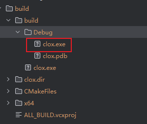
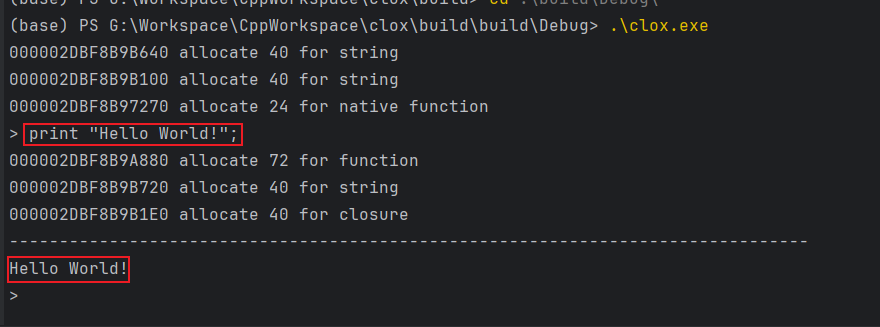

# 1. 前言
本项目为《Crafting Interpreters》中`clox`实现。本项目实现了执行`lox`脚本所需的词法解析器，语法解析器，虚拟机以及垃圾回收等功能。
# 2. 安装
## 安装cmake
在`clox`中，我们使用`cmake`来管理整个工程。因此，你需要先安装`cmake`。可以在`cmake`的官网下载。版本要求是`3.10`。
## 安装C++编译器
`clox`使用`C++`作为主要编程语言。因此，你需要安装一个支持`C++`的编译器。在Windows平台请先安装MSVC，在Linux平台请先安装GCC。
## 建立build目录
在`clox`的根目录下，建立`build`目录。用于存放编译后的产物。
## 编译
在`build`的目录下，执行以下命令：
```bash
cmake ..
cmake --build ./ --target clox -j 10
```
运行完成后，在`build/build/Debug`目录下，会生成`clox`的可执行文件。

可以在控制台运行该程序，如果以不带参数运行，默认会打开一个`prompt`，在其中输入`print "Hello, world!";`，然后回车，控制台就会输出`Hello, world!`。

其他的一些输出是GC的日志。